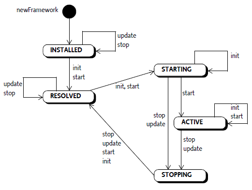
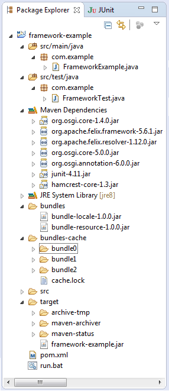

# OSGI

## Felix Framework в OSGi приложении

Создание OSGi приложения начинается с Framework'a. Сначала создается и инициализируется объект Framework, после чего можно загружать в автоматическом (запрограммированном) или ручном (по команде) режиме плагины/сервисы, именуемые согласно спецификации OSGi бандлы (Bundle). Объект Framework, иначе называемый также System Bundle, наследует свойства Bundle, описанные на странице спецификации OSGi.

Для создания объекта Framework используется класс FrameworkFactory. Ниже представлен код создания Felix Framework'a и загрузки бандлов.

```java
private ServiceLoader<FrameworkFactory> serviceLoader;
private Framework framework;
private File[] bundles;
...

serviceLoader = ServiceLoader.load(FrameworkFactory.class);

FrameworkFactory factory = serviceLoader.iterator().next();
if (factory != null) {
    Map<String, String> props = new HashMap<String, String>();
    props.put("org.osgi.framework.storage", "bundles-cache");
    props.put("org.osgi.framework.storage.clean", "onFirstInit");
//  props.put("org.osgi.framework.storage.clean", "none"); 
    framework = factory.newFramework(props);
}
if (framework != null) {
   // Прежде чем фреймворк можно будет использовать
   // его необходимо инициализировать
   framework.init();

   // После инициализации framework может предоставить
   // Bundle Context для регистрации бандлов и сервисов
   BundleContext context = framework.getBundleContext();

   // Инсталляция бандлов
   for (File bundle : bundles )
       context.installBundle(bundle.toURL().toString());

   framework.start();
}
```

Для создания фреймворка используется метод newFramework класса FrameworkFactory. Метод в качестве параметра получает коллекцию Map<String, String> для определения конфигурации фреймворка.

В примере определяется свойство "org.osgi.framework.storage" со значением "bundles-cache". При инсталляции фреймворк создаст директорию "bundles-cache"" с набором поддиректорий, которая будет использоваться в качестве хранилища бандлов. Свойство "org.osgi.framework.storage.clean" позволяет определить режим инсталляции. Если в качестве значения выбрать "onFirstInit", то фреймворк будет стартовать как в первый раз и поддиректория "bundles-cache" будет обновляться, в противном случае при значении "none" будут использоваться настройки от предыдущего старта.

По умолчанию Felix Framework создаёт директорию "felix-cache" для хранилища бандлов, если не определить параметр метода FrameworkFactory, т.е. передать значение props=null.

Примечание : фреймворк Equinox от IDE Eclipse для работы с бандлами использует директорию "configuration".

## Жизненный цикл OSGi Framework

OSGi Framework от момента создания и до окончательного останова проходит определенные стадии жизненного цикла, диаграмма состояний которого представлена на следующем рисунке.



Сразу же после создания Framework попадает в состояние INSTALLED. В этом состоянии Framework не активный и не может «предоставить» Bundle Context для регистрации bundle. С этого момента можно изменить состояние Framework'а с использованием различных методов :

<table>
    <tbody>
        <tr>
            <th>
                Метод
            </th>
            <th>
                Описание
            </th>
        </tr>
        <tr>
            <td>
                init
            </td>
            <td>
метод переводит Framework в состояние STARTING, если фреймворк не активный (ACTIVE) ;
            </td>
        </tr>
        <tr>
            <td>
                start
            </td>
            <td>
следует убедиться, что Framework находится в состоянии ACTIVE. Этот метод вызывается только для фреймворка пока не «запущен» ни один bundle;
            </td>
        </tr>
        <tr>
            <td>
                update
            </td>
            <td>
обновление Framework'a. Этот метод вызывает событие STOPPED_UPDATE или STOPPED_BOOTCLASSPATH_MODIFIED (перед вызовом waitForStop) для рестарта (restart) фреймворка и перевода его в предыдущее состояние. Стартер (launcher) должен выполнить соответствующее действие и после этого снова вызвать метод waitForStop или перезагрузить VM (Virtual Machine). Если фреймворк не находится в состоянии ACTIVE, то метод не имеет никакого эффекта.
            </td>
        </tr>
        <tr>
            <td>
                stop
            </td>
            <td>
перевод фреймворка в состояние RESOLVED через промежуточное состояние STOPPING.Данный метод возвращает событие STOPPED из метода waitForStop. Bundle Context фреймворка больше не «актуальный». Чтобы восстановить Bundle Context необходимо повторно инициализировать Framework.
            </td>
        </tr>
        <tr>
            <td>
                uninstall
            </td>
            <td>
метод нельзя вызывать, поскольку возникнет Exception.
            </td>
        </tr>
    </tbody>
</table>

### Метод waitForStop

OSGi Framework функционирует в multi-threaded окружении. После своего старта он инсталлирует и стартует бандлы. Активированный бандл стартует поток Thread или «отвечает» на запрос другого бандла после завершения метода start, т.е. находясь в состоянии ACTIVE.

Для остановки фреймворка вместе с бандлами необходимо использовать метод waitForStop(long), который содержит обработчик очистки загрузчика после того, как фреймворк будет полностью остановлен. Данный метод блокирует фреймворк до полной его остановки и возвращает одно из событий, показывающего причину остановки : 

- STOPPED - framework остановлен и может быть стартован заново;
- STOPPED_UPDATE - framework остановлен и будет перестартован. После рестарта framework будет переведен в состояние ACTIVE или STARTING, которое было перед возникновением события.
- STOPPED_BOOTCLASSPATH_MODIFIED - framework остановлен, поскольку a boot class path extension bundle has been installed or updated. Виртуальная машина VM должна быть перестартована.
- ERROR - framework столкнулся с ошибкой при останове или возникла ошибка, приведшая framework к останову;
- WAIT_TIMEDOUT - метод завершил свое действие прежде, чем этот framework был остановлен.

## Пример Framework'a в OSGi приложении

Рассмотрим пример создания фреймворка Apache Felix и перевод его в различные состояния от создания и до останова. Для разработки OSGi приложения будет использован фреймворк Maven. Структура приложения представлена на следующем скриншоте.



Согласно представленной структуре приложение включает классы FrameworkExample.java, FrameworkTest.java и проектный файл pom.xml, в котором определены все необходимые зависимости для разработки, тестирования и сборки.

Основным классом приложения является FrameworkExample.java, в котором создается фреймворк и инсталлируются бандлы. Приложение будет работать в консольном варианте и вся информация будет выводиться в консоль. FrameworkTest.java используется для тестирования фреймворка.

В поддиректории "bundles" размещены два бандла, рассмотренные на странице ресурсов OSGi. После создания фреймворка они будут инсталлированы в контейнер.

## Создание фреймворка

```java
Framework framework = null;
String    cache     = "bundles-cache";
private void createFramework()
{
    ServiceLoader<FrameworkFactory> serviceLoader;
    ServiceLoader.load(FrameworkFactory.class);

    FrameworkFactory factory = serviceLoader.iterator().next();

    try {
        if (factory != null) {
            Map<String, Stringg> props = new HashMap<String, String>();
            props.put("org.osgi.framework.storage", cache); 
            props.put("org.osgi.framework.storage.clean","onFirstInit");
            framework = factory.newFramework(props);
            if (framework != null) {
                System.out.println ("framework is created");
                printBundleParams(framework, "Framework");
            }
        }
    } catch(Exception e){
        System.err.println ("Create Framework Exception : " + e.getMessage());
    }
}
```

В результате выполнения процедуры createFramework будет создан фреймворк и хранилище бандлов "bundles-cache", в котором framework создаст свою поддиректорию bundle0.

После создания фреймворка инициализируем его методом init и стартуем (метод start). Таким образом фреймворк переходит в состояние ACTIVE.

## Инсталляция бандлов

При нахождении фреймворка в состояние ACTIVE можно инсталлировать бандлы, описанные в переменной files (см. код ниже). Процедура загрузки бандлов loadBundles в цикле проверяет наличие соответствующего файла, формирует адрес url и инсталлирует бандл в контейнер с использованием метода installBundle объекта BundleContext.

```java
String[]  files = {"bundles/bundle-locale-1.0.0.jar", 
                   "bundles/bundle-resource-1.0.0.jar"};
private void loadBundles()
{
    BundleContext ctx = framework.getBundleContext();
    Bundle bundle;
    String MSG_TEMPL = "Bundle <%s> installed";
    try {
        for (int i = 0; i < files.length; i++) {
            File file = new File (files[i]);
            if (file.exists()) {
                String location = file.toURI().toURL().toString();
                bundle = ctx.installBundle(location);
                if (bundle != null) {
                    String msg=String.format(MSG_TEMPL,file.getName());
                    System.out.println (msg);
                    printBundleParams(bundle, "Bundle");
                }
            }
        }
    } catch (MalformedURLException e) {
        e.printStackTrace();
    } catch (BundleException e) {
        e.printStackTrace();
    }
}
```
Для каждого инсталлируемого в контейнер бандла фреймворк создает в хранилище отдельную поддиректорию (bundle1, bundle2).

## Определение зависимостей в pom.xml

В проектном файле pom.xml необходимо определить зависимости фреймворка Apache Felix, который используется в приложении. Обратите внимание, что подключается версия фреймворка 5.6.1 и все связанные (необходимые для его функционирования) библиотеки.
```xml
<dependencies>
    <dependency>
        <groupId>org.osgi</groupId>
        <artifactId>org.osgi.core</artifactId>
        <version>6.0.0</version>
    </dependency>
    <dependency>
        <groupId>org.apache.felix</groupId>
        <artifactId>org.apache.felix.framework</artifactId>
        <version>5.6.1</version>
        <scope>runtime</scope>
    </dependency>

    <dependency>
        <groupId>org.apache.felix</groupId>
        <artifactId>org.apache.felix.resolver</artifactId>
        <version>1.12.0</version>
    </dependency>

    <dependency>
        <groupId>org.osgi</groupId>
        <artifactId>org.osgi.annotation</artifactId>
        <version>6.0.0</version>
    </dependency>

    <dependency>
        <groupId>junit</groupId>
        <artifactId>junit</artifactId>
        <version>4.11</version>
        <scope>test</scope>
    </dependency>
</dependencies>
```

## Сообщения в консоли
В результате работы приложения в консоль будет выведена следующая информация о состояниях фреймворка и инсталляции бандлов.

```terminal
Create framework ...
framework is created
   Framework state : INSTALLED
   Version = 5.6.1
   SymbolicName = org.apache.felix.framework
   Location = System Bundle
   BundleId = 0
Framework state : INSTALLED
Wait for stop event
expected frameworkEvent = STOPPED

Framework init ...
Framework state : STARTING
framework.getBundleContext() not NULL

Framework start ...
framework.getBundleContext() not NULL
Framework state : ACTIVE

Load bundles ...
Bundle <bundle-locale-1.0.0.jar> installed
   Bundle state : INSTALLED
   Version = 1.0.0
   SymbolicName = com.osgi.bundle.locale
   Location = file:/D:/framework-example/bundles/bundle-locale-1.0.0.jar
   BundleId = 1
Bundle <bundle-resource-1.0.0.jar> installed
   Bundle state : INSTALLED
   Version = 1.0.0
   SymbolicName = com.osgi.resources.resource
   Location=file:/D:/framework-example/bundles/bundle-resource-1.0.0.jar
   BundleId = 1

Enter exit : exit

Framework stop ...
Framework state before stop
Framework state : ACTIVE
FrameworkEvent STOPPED
framework.getBundleContext() is NULL
Framework state : RESOLVED

Framework update ...
Framework state : RESOLVED
Wait for stop event
expected frameworkEvent = STOPPED
```
После инсталляции бандлов приложение останавливается и просит ввести «exit», чтобы завершить работу.

## Запуск
### Сборка 
В intellij IDEA вкладка maven-pluging-assembly:assembly

### Настройка прав доступа
Если линукс, надо проверить права на выполнение для:
- bundles/bundle-locale-1.0.0.jar
- bundles/bundle-resource-1.0.0.jar

Должны быть права на выполнение.

### Запуск
В окне терминала:
```shell
java -jar target/framework-example.jar
```
### Результат работы в консоли
```shell
$ java -jar target/framework-example.jar
Create framework ...
WARNING: An illegal reflective access operation has occurred
WARNING: Illegal reflective access by org.apache.felix.framework.util.SecureAction (file:/home/nikez/IdeaProjects/framework-example/target/framework-example.jar) to method java.net.URLClassLoader.addURL(java.net.URL)
WARNING: Please consider reporting this to the maintainers of org.apache.felix.framework.util.SecureAction
WARNING: Use --illegal-access=warn to enable warnings of further illegal reflective access operations
WARNING: All illegal access operations will be denied in a future release
framework is created
   Framework state : INSTALLED
   Version = 5.6.1
   SymbolicName = org.apache.felix.framework
   Location = System Bundle
   BundleId = 0
Framework state : INSTALLED
Wait for stop event
expected frameworkEvent = STOPPED

Framework init ...
Framework state : STARTING
framework.getBundleContext() not NULL

Framework start ...
framework.getBundleContext() not NULL
Framework state : ACTIVE

Load bundles ...
load bundle from file:file:/home/nikez/IdeaProjects/framework-example/bundles/bundle-locale-1.0.0.jar
Bundle &lt;bundle-locale-1.0.0.jar&gt; installed
   Bundle state : INSTALLED
   Version = 1.0.0
   SymbolicName = com.osgi.bundle.locale
   Location = file:/home/nikez/IdeaProjects/framework-example/bundles/bundle-locale-1.0.0.jar
   BundleId = 1
load bundle from file:file:/home/nikez/IdeaProjects/framework-example/bundles/bundle-resource-1.0.0.jar
Bundle &lt;bundle-resource-1.0.0.jar&gt; installed
   Bundle state : INSTALLED
   Version = 1.0.0
   SymbolicName = com.osgi.resources.resource
   Location = file:/home/nikez/IdeaProjects/framework-example/bundles/bundle-resource-1.0.0.jar
   BundleId = 2


Enter exit : 
exit

Framework stop ...
Framework state before stop
Framework state : ACTIVE
FrameworkEvent STOPPED
framework.getBundleContext() is NULL
Framework state : RESOLVED

Framework update ...
Framework state : RESOLVED
Wait for stop event
expected frameworkEvent = STOPPED
$
```

## Первоисточник
https://java-online.ru/osgi-framework.xhtml
